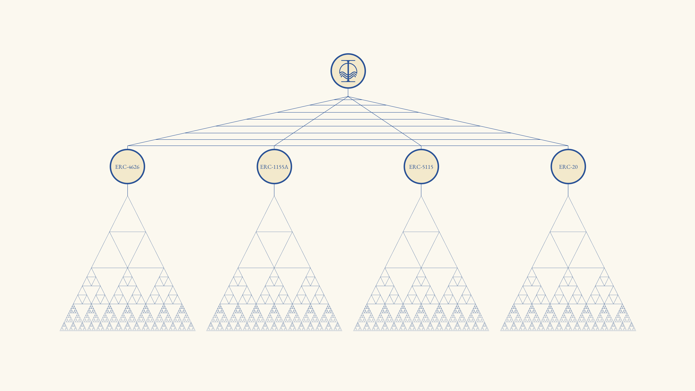

# contracts

Solidity smart contracts for the Flow Finance protocol, defining the tokenomics of the Flow Finance token and its ecosystem, including a suite of tokenized, machine-learning-driven financial strategies in DeFi.

